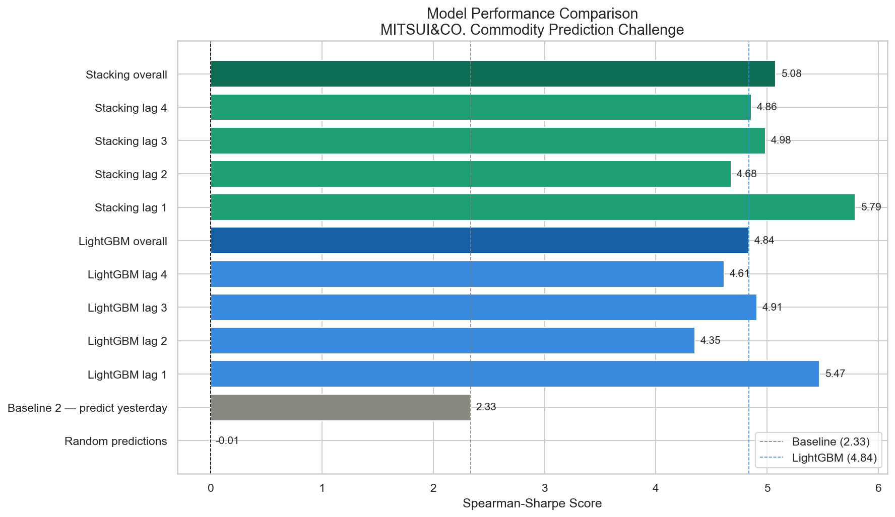
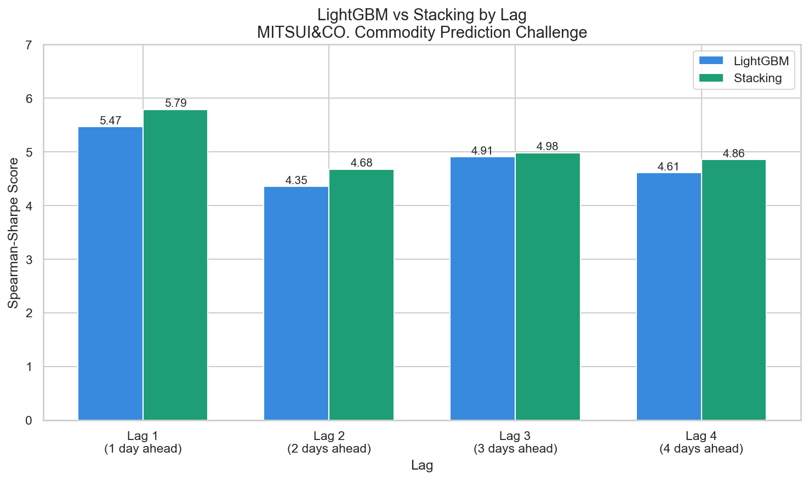

# MITSUI&CO. Commodity Prediction Challenge
### Portfolio & Learning Project — Financial Time-Series Return Forecasting

---


This is a complete machine learning pipeline I built on the MITSUI&CO. Commodity Prediction Challenge from Kaggle. I approached it as a portfolio and learning project, not a live competition entry (the competition closed September 29, 2025).

My core task: given daily historical price data from four global financial markets, predict the future log returns of 424 commodity assets and currency spreads, across 4 different time horizons (1 to 4 trading days ahead).

MITSUI & CO., LTD. is one of Japan's largest trading companies. They trade physical commodities — metals, energy, chemicals — across the world. Accurate commodity price forecasting directly affects their trading strategies, hedging decisions, and budgets worth billions of dollars. I chose this project because it combines real financial domain knowledge with production-level ML engineering.

---

## My Final Results

| Model | Lag 1 | Lag 2 | Lag 3 | Lag 4 | Overall |
|-------|-------|-------|-------|-------|---------|
| Random predictions | — | — | — | — | -0.01 |
| Baseline 1 — predict zero | — | — | — | — | NaN |
| Baseline 2 — predict yesterday | — | — | — | — | 2.3343 |
| LightGBM | 5.4711 | 4.3529 | 4.9086 | 4.6129 | 4.8364 |
| Stacking ensemble | 5.7926 | 4.6785 | 4.9842 | 4.8601 | 5.0789 |

My stacking ensemble achieved a 117% improvement over the predict-yesterday baseline and a 5% improvement over my single LightGBM model.





---

## Production Engineering

This project is built as a production-ready ML pipeline with:

- **MLflow** — every training run tracked with parameters, metrics and artifacts
- **Docker** — fully containerised, runs identically on any machine
- **CI/CD** — GitHub Actions runs tests and linting on every push
- **pytest** — 12 unit tests covering preprocessing, metrics and model behaviour

### Quick start — local

```bash
pip install -r requirements.txt

python train.py   --model lgbm
python train.py   --model stacking
python train.py   --model transformer

python predict.py --model lgbm
python evaluate.py --model all
```

### Quick start — Docker

```bash
docker build -t mitsui .
docker compose up mlflow -d
docker compose up train
docker compose up predict
docker compose up evaluate
docker compose down
```

### MLflow UI

`http://localhost:5000`

Every run logs hyperparameters, per-lag scores, training time and saved model files. All three models are comparable side by side in the experiment view.

### Running tests

```bash
pytest tests/ --tb=short
```

---

## The Dataset

### Files

| File | What it is | Rows | Columns |
|------|-----------|------|---------|
| train.csv | Market prices — my model's inputs | 1,961 trading days | 558 (date_id + 557 price cols) |
| train_labels.csv | Targets — what my model predicts | 1,961 trading days | 425 (date_id + 424 targets) |
| test.csv | Future prices I predict on | 134 trading days | 559 (includes is_scored) |
| test_labels_lag_1.csv | Actual returns 1 day ahead | ~133 rows | date_id + label_date_id + 424 targets |
| test_labels_lag_2.csv | Actual returns 2 days ahead | ~132 rows | date_id + label_date_id + 424 targets |
| test_labels_lag_3.csv | Actual returns 3 days ahead | ~131 rows | date_id + label_date_id + 424 targets |
| test_labels_lag_4.csv | Actual returns 4 days ahead | ~130 rows | date_id + label_date_id + 424 targets |
| target_pairs.csv | Maps each target to its assets and lag | 424 rows | target, lag, pair |

### The date_id Column

date_id is a single integer column I use to count trading days sequentially from 0 to 1960. No calendar dates are written just sequential integers. Weekends and holidays have no rows. The label files additionally contain label_date_id which shows which future day the return is measured to. I always join files on date_id only, never on label_date_id.

### The 557 Feature Columns

Every column follows the pattern MARKET_INSTRUMENT_PRICETYPE. For example LME_CA_Close means London Metal Exchange, Copper, closing price. FX_USDJPY_Close means Forex, USD/JPY exchange rate, closing value.

Price type suffixes: Open (start of day), High (daily peak), Low (daily trough), Close (end of day — most important, used to compute returns), Volume (contracts traded), OpenInterest (outstanding futures contracts).

### The Four Markets

LME (London Metal Exchange) — base metals in USD per tonne. The 6 metals I work with: Copper (CA), Aluminium (AH), Zinc (ZS), Lead (PB), Nickel (NI), Tin (SN). Most important market in my dataset. Copper demand tracks global economic health  called "Dr Copper."

JPX (Japan Exchange Group) — Japanese equities and futures in JPY. Key instruments I use: Nikkei 225, TOPIX, Gold and Platinum futures. Japan is a massive metals importer. JPX has different holidays than LME the primary reason I have 4 lag files.

US Stocks — American equity markets in USD. S&P 500, Dow Jones, Nasdaq, sector ETFs. I use these as macro sentiment signals risk-on vs risk-off.

FX (Foreign Exchange) — currency pairs from Exchange Rates API by APILayer. Key pairs I work with: USD/JPY (most important — USD strength drives commodity prices down), EUR/USD, GBP/USD, AUD/USD (commodity currency leads commodity prices), CNY/USD.

The key FX relationship I exploit: commodities are priced in USD. When USD strengthens, commodities become more expensive for non-USD buyers, demand falls, prices fall. A weaker USD pushes commodity prices up.

### The 424 Prediction Targets

All 424 targets are columns in the label files. Each value is a log return — a small decimal like +0.0200 meaning +2%.

Type 1 — Single asset returns (4 out of 424): I predict the log return of one asset. Example: LME_CA_return = copper's log return.

Type 2 — Spread returns (420 out of 424): I predict the return of one asset minus the return of another. Example: LME_CA_minus_ZS = copper return minus zinc return. Spreads filter out macro moves affecting all assets equally, isolating relative strength signals between pairs.

Log return formula I use: return = log(price_future) - log(price_today). Example: copper $9,000 today, $9,180 tomorrow → return = log(9180) - log(9000) = +0.0200 = +2.0%.

I use returns instead of raw prices because returns are stationary — their statistical properties stay stable over time. Raw prices trend upward for decades and break ML models trained in earlier price regimes.

### target_pairs.csv — The Most Important File

This file maps every target to the exact asset(s) it was computed from. Each row has three columns: target (the label column name), lag (how many days ahead), and pair (which asset or assets were used).

Example: target_2 | 1 | LME_CA_Close - LME_ZS_Close

This means target_2 = log(copper_day_d+1) - log(copper_day_d) MINUS log(zinc_day_d+1) - log(zinc_day_d).

```
target_pairs.csv says:
  target_408 | lag=4 | LME_AH_Close - FX_ZARCHF

This means train_labels.csv computed target_408 as:
  [log(LME_AH_Close day d+4) - log(LME_AH_Close day d)]
  MINUS
  [log(FX_ZARCHF day d+4) - log(FX_ZARCHF day d)]

And train.csv provides:
  LME_AH_Close on day d → plain raw price, belongs to that day only
  FX_ZARCHF on day d    → plain raw price, belongs to that day only
```

This file was my key insight from studying the 3rd place solution. Instead of using all 557 columns for every model, I build features only from the assets defined in each target's pair column. This dramatically reduces noise and was the biggest driver of my model's performance.

### The 4 Lags

Lag = the number of trading days between today (my observation) and the future target date.

- Lag 1 → I predict return 1 trading day from now (test_labels_lag_1.csv)
- Lag 2 → I predict return 2 trading days from now
- Lag 3 → I predict return 3 trading days from now
- Lag 4 → I predict return 4 trading days from now

I have 106 targets per lag, perfectly balanced. Two reasons for 4 lags: different horizons capture different signals, and LME and JPX have different holiday calendars so "1 trading day ahead" means different calendar dates for different markets.

Important: the word "lag" has two meanings in my code. In the competition structure it means prediction horizon. In my feature engineering it means a past value I use as a current feature (shift by N days). They are completely different concepts.

---

## Data Leakage — The Most Critical Concept

Leakage = accidentally using future information during training. It makes my model look perfect locally but fail in production.

The three ways I prevent it:

I never use random train/test splits — future rows would leak into training. I always use TimeSeriesSplit so training always ends before validation begins.

I always shift(1) all features — using today's closing price to predict today's return would be leakage because I would not know today's close until the market closes. Shifting by 1 ensures today's feature contains yesterday's value.

I always shift rolling windows after computing them — a 20-day rolling average includes today's value. I shift the result by 1 day after computing so today's feature only uses yesterday's window.

My golden rule: every feature I create for date_id=N can only use information from date_ids less than N.

---

## The Evaluation Metric — Spearman Sharpe

Score = mean(daily Spearman correlations) / std(daily Spearman correlations)

It measures how consistently my model correctly ranks assets from best to worst performance, every single day.

How I compute it:
1. Each trading day: I compute Spearman rank correlation between my 424 predictions and 424 actual returns
2. I collect all daily scores into a list
3. Final score = mean of list / std of list

```
date_id=0:
  actual ranks    : [1, 2, 3, ...]  (across targets: target_0, target_1, ...)
  predicted ranks : [1, 2, 3, ...]
  daily_corrs list → corr = 0.85

Final grade = mean / std of all daily correlation scores
```

I use Spearman because it only checks rank order — if I correctly predict copper will outperform zinc, I score well even if my exact magnitudes are wrong. This maps directly to trading profitability.

I divide by std because the Sharpe ratio principle applies — consistency is rewarded as much as accuracy. One terrible day raises std and destroys my score.

Score benchmarks I use: below 0.5 = poor, 0.5–1.0 = acceptable, 1.0–2.0 = good, above 2.0 = excellent.

---

## My Methodology

### Feature Engineering

For each target, I build features only from the assets defined in target_pairs.csv. I create 34 features per spread target and 16 per single asset target. Feature types I create and my reasoning for each:

---

#### Feature 1 — Log Return

```
Percentage Return = ((Pt - Pt-1) / Pt-1) × 100
Example: ((110 - 100) / 100) × 100 = 10%

Log Return = ln(Pt / Pt-1)
Example: ln(110 / 100) = 0.0953
```

Log returns are preferred because they are additive over time and work better for financial analysis and forecasting. I use these to capture momentum at multiple horizons. Assets that have been rising tend to continue rising short-term. Multiple horizons let my model learn which time horizon matters most for each specific target.

```
log_return_1d  = log(price today) - log(price 1 day ago)
log_return_3d  = log(price today) - log(price 3 days ago)
log_return_5d  = log(price today) - log(price 5 days ago)
log_return_10d = log(price today) - log(price 10 days ago)
```

All of these are shifted by 1 day before being used as features. So the feature value on date_id=5 is actually the log return computed up to date_id=4.

---

#### Feature 2 — Rolling Mean

A rolling mean is the average of the log return over the past N days. It smooths out daily noise and captures the overall trend direction. I use three window sizes to capture short, medium, and monthly trend regimes.

```
rolling_mean_5d = average of last 5 daily log returns

date_id=4: average of returns on days 0,1,2,3,4
         = average of (NaN, +0.00621, -0.00867, +0.00467, +0.01770)
         = +0.00498  ← copper has been trending slightly up

rolling_mean_5d   = average daily return over past 5 days
rolling_mean_10d  = average daily return over past 10 days
rolling_mean_20d  = average daily return over past 20 days
```

Again shifted by 1 day to prevent leakage.

---

#### Feature 3 — Rolling Standard Deviation / Volatility

Standard deviation measures how much the daily returns have been varying. High std means volatile market. Low std means calm market. High volatility means unpredictable markets. The Sharpe metric rewards consistency so volatility features are especially important.

```
rolling_std_5d = std of last 5 daily log returns

date_id=4: std of (NaN, +0.00621, -0.00867, +0.00467, +0.01770)
         = 0.00893  ← moderate volatility

date_id=9: if all returns were +0.00100 every day
         std = 0.00000  ← no volatility at all

rolling_std_5d   = volatility over past 5 days
rolling_std_10d  = volatility over past 10 days
rolling_std_20d  = volatility over past 20 days
```

---

#### Feature 4 — Price Difference

A price difference is simply today's price minus the price N days ago in raw terms. I include these to capture absolute magnitude of moves, complementing log returns by showing dollar-size rather than just percentage.

```
diff_1d = price today - price 1 day ago
diff_3d = price today - price 3 days ago
diff_5d = price today - price 5 days ago
```

---

#### Feature 5 — Lagged Price Levels

This is simply the raw price from N days ago used directly as a feature. I use these as anchor points for mean reversion detection. My model can learn patterns like "copper near a 5-day high tends to consolidate."

```
price_lag1 = price 1 day ago
price_lag3 = price 3 days ago
price_lag5 = price 5 days ago

date_id=5:
  price_lag1 = LME_CA_Close on date_id=4 = 9180.00
  price_lag3 = LME_CA_Close on date_id=2 = 8978.00
  price_lag5 = LME_CA_Close on date_id=0 = 9000.00
```

---

#### Feature 6 — Spread Return (for spread targets only)

For targets that are asset A minus asset B, I create all the above features for both assets separately. I also create one additional feature — the spread between their recent returns. My feature importance analysis confirmed these are consistently the most important features.

```
spread_ret_1d = log_return_1d of asset A - log_return_1d of asset B
spread_ret_5d = log_return_5d of asset A - log_return_5d of asset B
```

---

### My Preprocessing Pipeline

I follow the 3rd place winner's approach in this exact order:

**log1p transform with sign preservation** — applies log(1 + |x|) × sign(x) to compress extreme values. A feature value of 10,000 becomes about 9.2. A value of 0.001 stays near 0.001. This reduces the influence of outliers while preserving direction.

**Replace infinities with NaN** — after log transforms and divisions, infinite values can appear. They are replaced with NaN before imputation.

**Median imputation** — all remaining NaN values are replaced with the median of that feature column. Median is more robust than mean because it is not affected by extreme outliers in financial data.

**StandardScaler** — scales all features to zero mean and unit variance. After scaling, a value of +1 means "1 standard deviation above average" regardless of what the original unit was. This helps the model treat all features equally.

I always fit these transformations on training data only and apply them to test data using training statistics. Refitting on test data would be leakage.

---

### My Models

#### Baseline 1 — Predict Zero

```
## Model 1
— Baseline 1: Predict Zero for Everything
```

Predicting zero is the simplest possible prediction — it requires no data, no features, no training. It sets the absolute floor. Any real model must beat this score. Scored NaN because all identical predictions have no rank order for Spearman to measure.

#### Baseline 2 — Predict Yesterday's Return

Baseline 2 predicts that tomorrow's return will equal today's return. This captures the simplest possible momentum signal — if copper rose today, predict it will rise tomorrow. No features, no training, just one shift of the actual labels. This is the smarter baseline — it uses real information from the data. Scored 2.33. I was surprised how strong this was — it confirmed short-term momentum is the dominant signal in this dataset.

#### LightGBM (one model per target)

I trained gradient boosted trees on 34 target-specific features. Fast, handles missing values natively, works well on tabular data. My overall score was 4.84 — a 107% improvement over the baseline.

#### Stacking Ensemble (one model per target)

I implemented the 3rd place winner's two-level ensemble approach.

```
Original features (34 columns)
       ↓
  ┌────────────────────────────┐
  │ LightGBM  → pred_lgbm     │  Level 0
  │ RandomForest → pred_rf    │
  │ XGBoost   → pred_xgb      │
  └────────────────────────────┘
       ↓
  [pred_lgbm, pred_rf, pred_xgb]  ← 3 columns
       ↓
  XGBoost meta-model              Level 1
       ↓
  final prediction
```

**Level 0 — Base Learners**

**LightGBM** (`pred_lgbm`)
A gradient boosting framework that builds trees leaf-wise rather than depth-wise. It is fast and memory-efficient on tabular data. It handles the 34 engineered features well and captures non-linear interactions between rolling returns, volatility, and price lags. `num_leaves=31`, `learning_rate=0.05`, `n_estimators=100`.

**Random Forest** (`pred_rf`)
An ensemble of independently trained decision trees, each trained on a random subset of features and bootstrap samples of data. Unlike boosting, trees are not corrected iteratively — diversity comes from randomness. It provides a structurally different signal to the meta-model, reducing overfitting risk in the stack. `n_estimators=100`, `max_depth=6`, `min_samples_leaf=5`.

**XGBoost** (`pred_xgb`)
A regularised gradient boosting implementation that builds trees depth-wise. It adds L1/L2 regularisation terms to the loss function, making it more robust to outliers than LightGBM on small datasets. Configured shallower (`max_depth=4`) than LightGBM to complement it rather than duplicate it. `n_estimators=100`, `learning_rate=0.05`.

**Level 1 — Meta-Model**

**XGBoost meta-model**
Takes the three base-learner predictions (`pred_lgbm`, `pred_rf`, `pred_xgb`) as its only input features and learns how to optimally blend them. Because the meta-model sees only 3 columns, it is kept deliberately small (`n_estimators=50`, `max_depth=3`) to avoid overfitting. It learns when to trust each base learner — for example, upweighting LightGBM when volatility is high, or Random Forest when the signal is noisy.

My overall score was 5.08 — beating LightGBM on every single lag.

#### Transformer Encoder (new)

PyTorch multi-head self-attention model. Each of the 34 features is treated as a token. Learned positional embeddings. 4 encoder layers, 8 attention heads, d_model=64. Trained with AdamW + CosineAnnealingLR + gradient clipping.

```
34 features → Feature Embedding (34×64) → Learned Positional Embedding
           → 4× TransformerEncoderLayer (multi-head attention)
           → Global Average Pooling → Linear → predicted return
```

Score: TBD — run `python evaluate.py --model all` after training to compare.

---

### My Validation Strategy

I use TimeSeriesSplit with 5 folds — I never shuffle. My training always ends before validation begins. My training set grows with each fold:

- Fold 1: I train on rows 0–374, validate on 375–749
- Fold 2: I train on rows 0–749, validate on 750–1124
- Fold 3: I train on rows 0–1124, validate on 1125–1499
- Fold 4: I train on rows 0–1499, validate on 1500–1687
- Fold 5: I train on rows 0–1687, validate on 1688–1874

I use CV to estimate performance, then retrain on the full history for my final models. This is the same approach the 3rd place winner used — more training data gives better final models.

---

## Project Structure

```
MITSUI-COMMODITY-PREDICTION-CHALLENGE/
│
├── src/
│   ├── config.py          all hyperparameters and file paths
│   ├── features.py        feature engineering functions
│   ├── preprocessing.py   imputation and scaling pipeline
│   ├── model.py           StackingModel class
│   ├── transformer.py     TransformerModel (PyTorch)
│   ├── metrics.py         Spearman-Sharpe metric
│   └── __init__.py
│
├── tests/
│   ├── conftest.py        shared synthetic data fixtures
│   ├── test_preprocessing.py
│   ├── test_metrics.py
│   └── test_model.py
│
├── notebook/
│   ├── 01_eda.py
│   ├── 02_feature_engineering.py
│   ├── 03_baseline_model.py
│   ├── 04_lgbm_model.py
│   ├── 05_stacking_model.py
│   └── 06_evaluation_writeup.py
│
├── train.py               training entry point
├── predict.py             inference entry point
├── evaluate.py            evaluation entry point
├── Dockerfile
├── docker-compose.yml
├── requirements.txt
│
├── .github/
│   └── workflows/
│       ├── ci.yml         runs on every push
│       └── cd.yml         runs on merge to main
│
├── data/                  place CSV files here (gitignored)
├── models/                trained models saved here (gitignored)
├── logs/                  training logs (gitignored)
└── assets/                charts and plots
```

---

## Libraries I Used

| Library | Why I used it |
|---------|--------------|
| pandas | Data manipulation and feature engineering |
| numpy | Array operations and mathematical functions |
| matplotlib / seaborn | Visualisation of results and feature importance |
| scikit-learn | TimeSeriesSplit, SimpleImputer, StandardScaler |
| lightgbm | My primary gradient boosting model |
| xgboost | Second gradient boosting model in my stacking ensemble |
| scipy.stats | Spearman rank correlation for my metric |
| joblib | I save and load my trained models |
| tqdm | Progress bars so I can track training |

---

## My Key Findings

1. Short-term momentum is strong — predicting yesterday's return scored 2.33, confirming momentum is the dominant signal. My features needed to capture this.

2. Spread features are most important — spread_ret_1d and spread_ret_5d consistently ranked as my top features. Features that directly mirror the target structure are most predictive.

3. Feature restriction beats feature abundance — using only 34 target-specific features outperformed using all 557 columns. Less noise, more signal.

4. Lag 1 is most predictable — shorter horizons have stronger signals. My score drops from 5.79 at lag 1 to 4.86 at lag 4. More random events occur over longer horizons.

5. Stacking provides consistent but modest improvement — +5% over single LightGBM, beating every lag. My main gains came from feature engineering, not model complexity.

---

## References

- Kaggle Competition: https://www.kaggle.com/competitions/mitsui-commodity-prediction-challenge
- Demo Submission Notebook: https://www.kaggle.com/code/sohier/mitsui-demo-submission/
- Metric Source Code: https://www.kaggle.com/code/metric/mitsui-co-commodity-prediction-metric
- 3rd Place Solution Writeup: competition discussion forum
- AlpacaTech Co., Ltd. — problem design and data creation
- Exchange Rates API by APILayer — Forex data source
